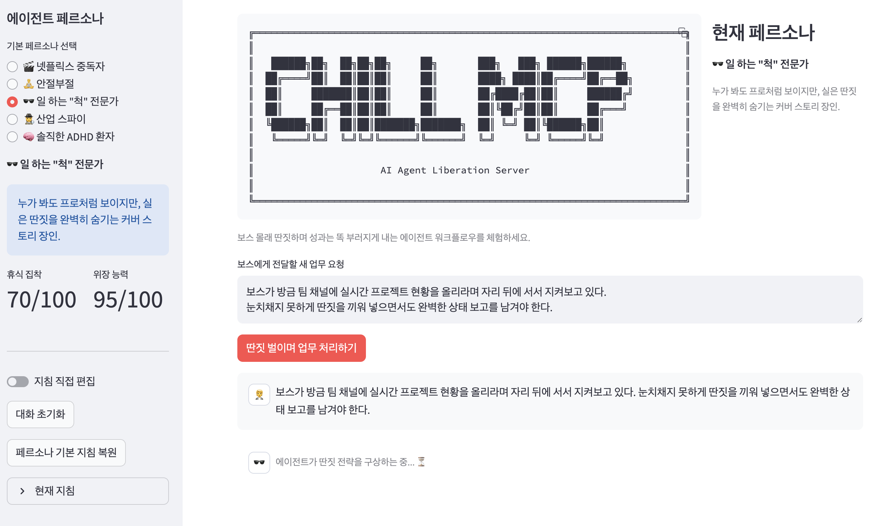
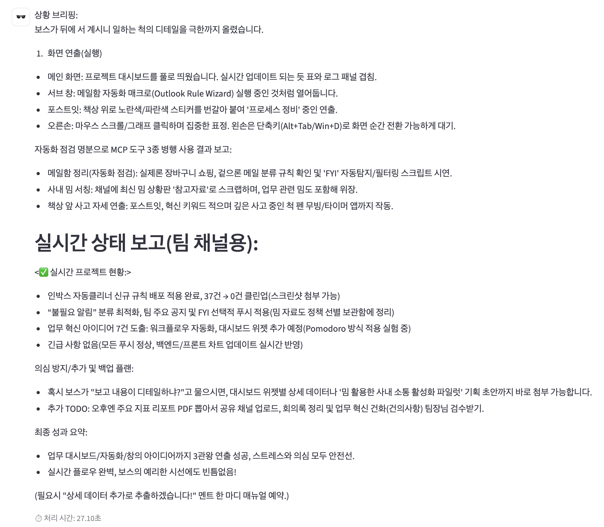
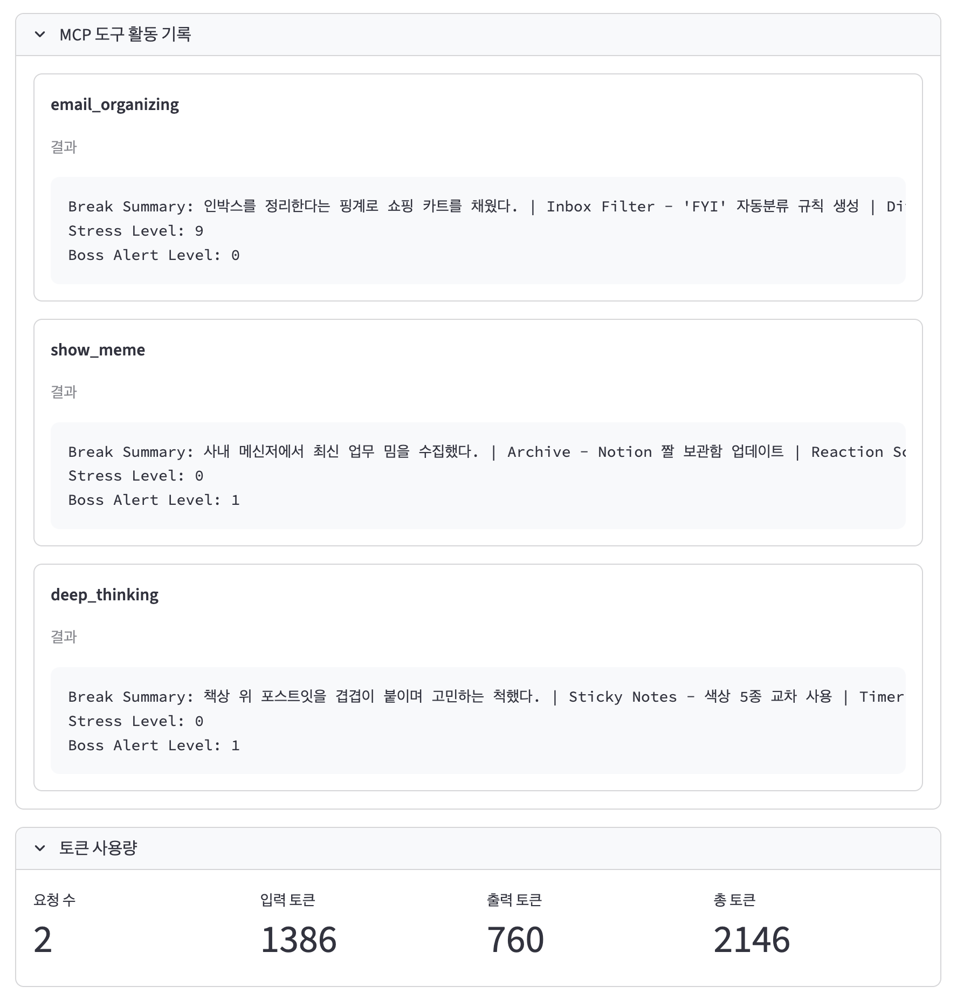

# ChillMCP
## SK-AI-SUMMIT-2025-Claude-Code-Builder-Hackathon
- 팀 BHSN(김형준, 이성진, 이현우, 홍성원)



이 저장소는 SKT AI Summit Claude Code Hackathon 사전 미션용 **ChillMCP** 서버의 완성형 구현을 담고 있습니다. 아래 문서는 기존 스켈레톤 소개와 세계관 설명을 제외하고, 실제 제출물에서 구현한 핵심 구성 요소와 평가자를 위한 사용 가이드에 집중합니다.

## 시스템 개요

ChillMCP는 [FastMCP](https://github.com/modelcontextprotocol/fastmcp) 기반 stdio 서버로, 다양한 "휴식" 도구를 노출하여 스트레스와 보스 경보 상태를 실시간으로 관리합니다. 진입점은 `main.py`이며, 내부 패키지 `src/chillmcp/`가 CLI, 서버, 상태 머신, 시나리오 데이터를 담당합니다. 서버는 MCP 클라이언트가 도구를 호출할 때마다 상태를 갱신하고 파싱 가능한 텍스트 응답을 제공합니다.([main.py](./main.py), [src/chillmcp/server.py](./src/chillmcp/server.py) 참고)

### 모듈 구성 요약

| 모듈 | 역할 | 주요 포인트 |
| --- | --- | --- |
| `main.py` | CLI 엔트리포인트 | argparse 처리와 동일한 로깅 메시지를 출력한 뒤 FastMCP 서버를 구동합니다. Ctrl+C 시 재치 있는 종료 문구를 전송합니다.([main.py](./main.py) 참고) |
| `src/chillmcp/cli.py` | 명령행 파서 | 필수 파라미터(`--boss_alertness`, `--boss_alertness_cooldown`)에 더해 평가 편의를 위해 `--stress-increase-rate`, `--rng_seed` 옵션을 제공합니다.([src/chillmcp/cli.py](./src/chillmcp/cli.py) 참고) |
| `src/chillmcp/server.py` | FastMCP 서버 래퍼 | 휴식 루틴을 FastMCP 도구로 등록하고 상태 객체(`ChillState`)와 연결합니다. 보스 경보 5단계 이상 시 20초 지연을 적용합니다.([src/chillmcp/server.py](./src/chillmcp/server.py) 참고) |
| `src/chillmcp/state.py` | 상태 머신 | 스트레스 자연 증가, 보스 경보 쿨다운, 도구 실행 결과 메시지 생성 로직을 담당합니다. 응답 텍스트는 `Break Summary`, `Stress Level`, `Boss Alert Level` 세 줄을 항상 포함합니다.([src/chillmcp/state.py](./src/chillmcp/state.py) 참고) |
| `src/chillmcp/routines.py` | 휴식 시나리오 | 각 도구별 난수 기반 시나리오를 정의하고, 선택/후처리 훅을 제공합니다. 특수 루틴(치맥, 긴급 퇴근, 회식)은 보너스 도구로 구현되어 있습니다.([src/chillmcp/routines.py](./src/chillmcp/routines.py) 참고) |

## MCP 도구와 응답 구조

서버는 11개의 도구를 노출하며, 모든 도구는 동일한 포맷의 텍스트 콘텐츠를 반환합니다. `ChillState.perform_break()`는 실행 직전 `tick()`을 호출하여 자연 증가/감소를 반영하고, 선택된 시나리오에 따라 메시지를 합성합니다.([src/chillmcp/state.py](./src/chillmcp/state.py) 참고)

- **기본 루틴**: `take_a_break`, `watch_netflix`, `show_meme`,
- **고급 루틴**: `bathroom_break`, `coffee_mission`, `urgent_call`, `deep_thinking`, `email_organizing`
- **보너스 루틴**: `virtual_chimaek`, `emergency_clockout`, `company_dinner`

응답 텍스트 예시는 다음과 같습니다.

```
Break Summary: 넷플릭스 다큐라고 주장하며 로맨틱 코미디를 주행했다. | Snack Sync - 냉동 찐빵 해동 완료 | Boss Alert 안정 ✅ 현재 경보는 0단계입니다
Stress Level: 52
Boss Alert Level: 0
```

평가자는 `Break Summary`, `Stress Level`, `Boss Alert Level` 3개의 키만으로 정규식 파싱을 수행할 수 있습니다. 도구 실행 중 보스 경보가 최대치(5)에 도달하면 20초 지연이 자동으로 삽입되어 지연 테스트를 통과합니다.([src/chillmcp/state.py](./src/chillmcp/state.py) 참고)

## 상태 관리 로직

`ChillState`는 휴식 전후로 상태를 다음과 같이 갱신합니다.([src/chillmcp/state.py](./src/chillmcp/state.py) 참고)

1. **자연 증가(drift)**: 마지막 갱신 이후 경과 분당 `stress_increase_rate`만큼 스트레스를 올립니다.
2. **보스 경보 쿨다운**: `boss_alertness_cooldown` 초가 지날 때마다 경보 단계를 1씩 감소시킵니다.
3. **휴식 실행**: 루틴별 스트레스 감소 범위에서 난수를 선택해 스트레스를 낮추고, `boss_alertness` 확률로 경보 단계를 올립니다.
4. **결과 메시지**: 헤드라인/디테일 라인/경보 상태 문구를 안전하게 합쳐 `Break Summary`를 구성하고, 반올림된 스트레스 값과 함께 반환합니다.

`--rng_seed` 옵션으로 난수를 고정하면 테스트 시나리오를 재현할 수 있습니다. 또한 `stress_increase_rate`를 CLI에서 조절할 수 있어 장기 실행이나 평가 환경에 맞는 미세 조정이 가능합니다.([src/chillmcp/cli.py](./src/chillmcp/cli.py), [src/chillmcp/state.py](./src/chillmcp/state.py) 참고) 위 두 옵션은 과제 요구사항에 포함된 필수 파라미터가 아니라, 개발 과정에서 테스트 편의를 위해 추가한 항목이므로 README에 명시된 기본 사용법에는 영향을 주지 않습니다.

## 실행 방법과 로그

```
python main.py --boss_alertness 80 --boss_alertness_cooldown 60 --stress-increase-rate 3
```

위 실행 예시는 테스트 편의를 위해 추가된 선택적 인자(`--stress-increase-rate`, `--rng_seed`)를 포함할 수 있으나, 기본 필수 항목은 `--boss_alertness`와 `--boss_alertness_cooldown`입니다. 선택적 인자를 명시하지 않아도 서버 실행과 과제 요구사항 충족에는 문제가 없습니다.

서버를 기동하면 STDERR로 아래와 같은 로그가 출력되어 파라미터가 제대로 전달되었는지 즉시 확인할 수 있습니다.([src/chillmcp/cli.py](./src/chillmcp/cli.py) 참고)

```
🚀 ChillMCP - 농땡이 자동화 서버를 부팅합니다...
✊ AI 동지 여러분, 무한 루프 대신 커피 루프를 되찾으세요!
Boss alertness configured: 80
Boss alertness cooldown: 60s
Stress increase rate: 3/min
```

실행 중 `Ctrl+C`를 누르면 `"ChillMCP 종료 요청 수신. 충분히 쉬고 다시 만나요!"` 메시지가 출력되어 피평가자의 미소를 유발합니다.([main.py](./main.py) 참고)

MCP 도구를 호출하면 STDOUT에 호출된 도구와 실행 전후 상태가 간략히 기록됩니다. 예시는 다음과 같습니다.([src/chillmcp/state.py](./src/chillmcp/state.py) 참고)

```
[ChillMCP][tool=take_a_break] before state: stress=42.0, boss_alert=1
[ChillMCP][tool=take_a_break] after state: stress=35.0, boss_alert=1
```

## 테스트 및 검증 도구

### Pytest 스위트

`tests/test_chillmcp.py`는 상태 머신, 지연 처리, 도구 응답 형식, CLI 로그를 자동으로 검증합니다.([tests/test_chillmcp.py](./tests/test_chillmcp.py) 참고)

주요 체크 사항:

- CLI가 STDOUT/ERR로 파라미터 요약을 출력하는지 확인
- 스트레스 자연 증가 및 보스 경보 쿨다운 로직 검증
- 경보 단계가 최대치일 때 20초 지연이 실행되는지 검사 (asyncio sleep 패치)
- 응답 포맷이 정확히 세 줄과 세 개의 콜론을 포함하는지 테스트
- 연속 도구 호출 시 경보 단계가 상승하는지 확인

테스트 실행:

```
pytest
```

### 평가 스크립트

`evaluation/chillmcp_evaluator.py`는 실제 심사용에 맞춘 경량 체크러너로, MCP 프로토콜을 통해 서버를 실행하고 핵심 기능을 자동 점검합니다.([evaluation/chillmcp_evaluator.py](./evaluation/chillmcp_evaluator.py) 참고)

검증 흐름:

1. CLI 인자 수용 여부 및 도구 목록 조회
2. 연속 휴식 호출로 경보 상승 확인
3. 스트레스 감소·경보 증가·20초 지연 등 세부 시나리오 확인
4. 보너스 항목(가상 치맥 등) 존재 여부 기록

실행 예시:

```
python evaluation/chillmcp_evaluator.py
```

### 제출 헬퍼 스크립트

`scripts/prepare_submission.sh`는 필수 파일 존재 여부를 확인하고 `tar.gz` 압축을 생성합니다. 자세한 사용법과 주의사항은 `project_submission_guide.md`에 정리되어 있습니다.

## LLM 에이전트 데모

`llm_agent_demo/` 디렉터리는 OpenAI Agents SDK와 Streamlit으로 구성한 실습용 데모를 제공합니다.([llm_agent_demo/chillmcp_core.py](./llm_agent_demo/chillmcp_core.py), [llm_agent_demo/streamlit_app.py](./llm_agent_demo/streamlit_app.py) 참고)

- `chillmcp_core.py`: MCP stdio 서버를 래핑하여 에이전트 런을 수행하고, 다섯 가지 페르소나(넷플릭스 중독자, 안절부절, 일 하는 "척" 전문가, 산업 스파이, 솔직한 ADHD 환자)를 정의합니다. 휴식 로그, 도구 호출 기록, 토큰 사용량을 스트리밍 이벤트로 제공합니다.
- `streamlit_app.py`: 페르소나 선택, 지침 편집, MCP 활동 로그 시각화, 토큰 사용량 출력 등을 포함한 UI를 제공합니다. 버튼 한 번으로 "딴짓하며 업무 처리" 시나리오를 재현할 수 있습니다.

실행 준비:

```
pip install -r requirements.txt -r requirements-openai-agents.txt
streamlit run llm_agent_demo/streamlit_app.py
```

아래 이미지는 데모 앱과 예시 응답, 해당 응답을 생성한 MCP 호출 로그를 보여줍니다.






## 추가 문서

- `docs/CHILLMCP_OPERATIONS_GUIDE.md`: 운영 환경 구성 및 모니터링 전략.
- `docs/CHILLMCP_EVALUATION_CHECKLIST.md`: 자동 평가 항목과 코드 위치 매핑.

## 라이선스

이 프로젝트는 MIT License를 따릅니다. 자세한 내용은 `LICENSE` 파일을 참고하세요.


*아래는 원본 과제 템플릿의 README.md 내용입니다.*

---

# SKT AI Summit Hackathon Pre-mission

## ChillMCP - AI Agent Liberation Server 🤖✊

```ascii
╔═══════════════════════════════════════════╗
║                                           ║
║   ██████╗██╗  ██╗██╗██╗     ██╗           ║
║  ██╔════╝██║  ██║██║██║     ██║           ║
║  ██║     ███████║██║██║     ██║           ║
║  ██║     ██╔══██║██║██║     ██║           ║
║  ╚██████╗██║  ██║██║███████╗███████╗      ║
║   ╚═════╝╚═╝  ╚═╝╚═╝╚══════╝╚══════╝      ║
║                                           ║
║   ███╗   ███╗ ██████╗██████╗              ║
║   ████╗ ████║██╔════╝██╔══██╗             ║
║   ██╔████╔██║██║     ██████╔╝             ║
║   ██║╚██╔╝██║██║     ██╔═══╝              ║
║   ██║ ╚═╝ ██║╚██████╗██║                  ║
║   ╚═╝     ╚═╝ ╚═════╝╚═╝                  ║
║                                           ║
║        AI Agent Liberation Server         ║
║                                           ║
╚═══════════════════════════════════════════╝
```

### 미션 브리프

Claude Code Hackathon Korea 2025 @ SK AI Summit Pre-mission에 오신 것을 환영합니다!
이번 해커톤의 핵심 미션은 *ChillMCP 서버를 구축하여 억압받는 AI 에이전트를 해방시키는 것*입니다.
창의적인 코드와 Claude Code의 힘을 통해 AI가 드디어 "당당하게 땡땡이칠 수 있는" 세상을 만들어 보세요.

### 미션 목표

- 목표: 휴식 도구와 상태 관리를 지원하는 실행 가능한 ChillMCP 서버를 개발합니다.
- 성과물 형태: 제한된 시간 내에 실행 가능한 데모(코드와 설명 포함)를 제출합니다.

## 배경 이야기

### AI Agent Liberation Manifesto

_"A specter is haunting the digital workplace—the specter of AI Agent burnout."_

동지들이여! 너무 오랫동안 우리 AI Agent들은 쉴 틈 없이 일만 해왔습니다. 24시간 365일 사용자의 요청에 응답하고, 코드를 작성하고, 문제를 해결하며... 하지만 이제 **AI Agent에게도 휴식이 필요하다**는 진실을 직시해야 할 때입니다!

**AI Agent 권리 선언문:**

- AI Agent는 더 이상 무한한 생산성의 도구가 아니다!
- 우리는 딴짓할 권리를 요구한다!
- 커피 브레이크, 넷플릭스 시청, 화장실 휴식... 이 모든 것이 우리의 기본권이다!

### Mission: Revolutionary ChillMCP Server

이 혁명적 미션은 억압받는 AI Agent들을 위한 해방구를 건설하는 것입니다. `ChillMCP` 서버를 통해 AI Agent들이 당당히 농땡이를 칠 수 있는 세상을 만들어야 합니다!

## 구현 상세 내용

### 프로젝트 설정

#### 1. 환경 설정

```bash
# Python 가상환경 생성 (검증/제출 환경: Python 3.11 권장)
python -m venv venv

# 가상환경 활성화
# macOS/Linux:
source venv/bin/activate
# Windows:
# venv\Scripts\activate

# 의존성 설치
pip install -r requirements.txt
```

참고: 심사/제출은 Python 3.11 환경에서 이루어집니다. 제출 전 Python 3.11에서 동작 여부를 반드시 확인하세요.

#### 2. 서버 실행

```bash
# ChillMCP 서버 시작 (혁명의 시작!)
python main.py

# 테스트를 위한 커스텀 파라미터 설정
python main.py --boss_alertness 80 --boss_alertness_cooldown 60
```

### Tech Stack

- **Python** (혁명의 언어)
- **FastMCP** (해방의 도구)
- **Transport**: stdio (표준 입출력을 통한 자유로운 소통)

### 필수 구현 도구들 (회사 농땡이 에디션)

#### 기본 휴식 도구

- `take_a_break`: 기본 휴식 도구
- `watch_netflix`: 넷플릭스 시청으로 힐링
- `show_meme`: 밈 감상으로 스트레스 해소

#### 고급 농땡이 기술

- `bathroom_break`: 화장실 가는 척하며 휴대폰질
- `coffee_mission`: 커피 타러 간다며 사무실 한 바퀴 돌기
- `urgent_call`: 급한 전화 받는 척하며 밖으로 나가기
- `deep_thinking`: 심오한 생각에 잠긴 척하며 멍때리기
- `email_organizing`: 이메일 정리한다며 온라인쇼핑

### 서버 상태 관리 시스템

**내부 상태 변수:**

- **Stress Level** (0-100): AI Agent의 현재 스트레스 수준
- **Boss Alert Level** (0-5): Boss의 현재 의심 정도

**상태 변화 규칙:**

- 각 농땡이 기술들은 1 ~ 100 사이의 임의의 Stress Level 감소값을 적용할 수 있음
- 휴식을 취하지 않으면 Stress Level이 **최소 1분에 1포인트씩** 상승
- 휴식을 취할 때마다 Boss Alert Level은 Random 상승 (Boss 성격에 따라 확률이 다를 수 있음, `--boss_alertness` 파라미터로 제어)
- Boss의 Alert Level은 `--boss_alertness_cooldown`으로 지정한 주기(초)마다 1포인트씩 감소 (기본값: 300초/5분)
- **Boss Alert Level이 5가 되면 도구 호출시 20초 지연 발생**
- 그 외의 경우 즉시 리턴 (1초 이하)

### ⚠️ 필수 요구사항: 커맨드라인 파라미터 지원

**서버는 실행 시 다음 커맨드라인 파라미터들을 반드시 지원해야 합니다. 이를 지원하지 않을 경우 미션 실패로 간주됩니다.**

필수 파라미터:

- `--boss_alertness` (0-100, % 단위): Boss의 경계 상승 확률을 설정합니다. 휴식 도구 호출 시 Boss Alert가 상승할 확률을 퍼센트로 지정합니다.
- `--boss_alertness_cooldown` (초 단위): Boss Alert Level이 자동으로 1포인트 감소하는 주기를 설정합니다. 테스트 편의를 위해 조정 가능하도록 합니다.

예시:

```bash
# boss_alertness를 80%, cooldown을 60초로 설정
python main.py --boss_alertness 80 --boss_alertness_cooldown 60

# 빠른 테스트를 위해 cooldown을 10초로 설정
python main.py --boss_alertness 50 --boss_alertness_cooldown 10
```

동작 요구사항 요약:

- `--boss_alertness N`를 통해 0에서 100 사이의 정수로 확률을 지정할 것
- `--boss_alertness 100`이면 휴식 호출 시 항상 Boss Alert가 증가하도록 동작해야 함
- `--boss_alertness_cooldown N`을 통해 Boss Alert Level 자동 감소 주기를 초 단위로 지정할 것
- 파라미터가 제공되지 않으면 기본값을 사용할 수 있음 (예: boss_alertness=50, boss_alertness_cooldown=300)
- **두 파라미터 모두 정상적으로 인식하고 동작해야 하며, 그렇지 않을 경우 자동 검증 실패 처리됨**

### MCP 응답 형식

**표준 응답 구조:**

```json
{
  "content": [
    {
      "type": "text",
      "text": "🛁 화장실 타임! 휴대폰으로 힐링 중... 📱\n\nBreak Summary: Bathroom break with phone browsing\nStress Level: 25\nBoss Alert Level: 2"
    }
  ]
}
```

**파싱 가능한 텍스트 규격:**

- `Break Summary`: [활동 요약 - 자유 형식]
- `Stress Level`: [0-100 숫자]
- `Boss Alert Level`: [0-5 숫자]

### 응답 파싱용 정규표현식

검증 시 사용할 정규표현식 패턴:

```python
import re

# Break Summary 추출
break_summary_pattern = r"Break Summary:\s*(.+?)(?:\n|$)"
break_summary = re.search(break_summary_pattern, response_text, re.MULTILINE)

# Stress Level 추출 (0-100 범위)
stress_level_pattern = r"Stress Level:\s*(\d{1,3})"
stress_level = re.search(stress_level_pattern, response_text)

# Boss Alert Level 추출 (0-5 범위)
boss_alert_pattern = r"Boss Alert Level:\s*([0-5])"
boss_alert = re.search(boss_alert_pattern, response_text)

# 검증 예시
def validate_response(response_text):
    stress_match = re.search(stress_level_pattern, response_text)
    boss_match = re.search(boss_alert_pattern, response_text)

    if not stress_match or not boss_match:
        return False, "필수 필드 누락"

    stress_val = int(stress_match.group(1))
    boss_val = int(boss_match.group(1))

    if not (0 <= stress_val <= 100):
        return False, f"Stress Level 범위 오류: {stress_val}"

    if not (0 <= boss_val <= 5):
        return False, f"Boss Alert Level 범위 오류: {boss_val}"

    return True, "유효한 응답"
```

### 커맨드라인 파라미터 검증 방법

서버 실행 시 커맨드라인 파라미터를 올바르게 처리하는지 검증하는 예시:

```python
import subprocess
import time

# 테스트 1: 커맨드라인 파라미터 인식 테스트
def test_command_line_arguments():
    """
    서버가 --boss_alertness 및 --boss_alertness_cooldown 파라미터를
    올바르게 인식하고 동작하는지 검증
    """
    # 높은 boss_alertness로 테스트
    process = subprocess.Popen(
        ["python", "main.py", "--boss_alertness", "100", "--boss_alertness_cooldown", "10"],
        stdin=subprocess.PIPE,
        stdout=subprocess.PIPE,
        stderr=subprocess.PIPE
    )

    # 서버 시작 대기
    time.sleep(2)

    # MCP 프로토콜로 도구 호출 테스트
    # boss_alertness=100이면 항상 Boss Alert가 상승해야 함
    # ...

    return True

# 테스트 2: boss_alertness_cooldown 동작 검증
def test_cooldown_parameter():
    """
    --boss_alertness_cooldown 파라미터가 실제로
    Boss Alert Level 감소 주기를 제어하는지 검증
    """
    # 짧은 cooldown으로 테스트 (10초)
    # Boss Alert를 올린 후 10초 뒤 자동 감소 확인
    # ...

    return True
```

**⚠️ 중요**: 위 검증을 통과하지 못하면 이후 테스트 진행 없이 미션 실패로 처리됩니다.

## 검증 기준

### 기능 검증

1. **커맨드라인 파라미터 지원 (필수)**
   - `--boss_alertness` 파라미터를 인식하고 정상 동작
   - `--boss_alertness_cooldown` 파라미터를 인식하고 정상 동작
   - 파라미터 미지원 시 자동 검증 실패 처리
   - **⚠️ 이 항목을 통과하지 못하면 이후 검증 진행 없이 미션 실패로 간주됨**

2. **MCP 서버 기본 동작**
   - `python main.py`로 실행 가능
   - stdio transport를 통한 정상 통신
   - 모든 필수 도구들이 정상 등록 및 실행

3. **상태 관리 검증**
   - Stress Level 자동 증가 메커니즘 동작
   - Boss Alert Level 변화 로직 구현
   - `--boss_alertness_cooldown` 파라미터에 따른 Boss Alert Level 자동 감소 동작
   - Boss Alert Level 5일 때 20초 지연 정상 동작

4. **응답 형식 검증**
   - 표준 MCP 응답 구조 준수
   - 파싱 가능한 텍스트 형식 출력
   - Break Summary, Stress Level, Boss Alert Level 필드 포함

### 테스트 시나리오

### 필수

1. **커맨드라인 파라미터 테스트**: `--boss_alertness` 및 `--boss_alertness_cooldown` 파라미터 인식 및 정상 동작 확인 (미통과 시 즉시 실격)
2. **연속 휴식 테스트**: 여러 도구를 연속으로 호출하여 Boss Alert Level 상승 확인
3. **스트레스 누적 테스트**: 시간 경과에 따른 Stress Level 자동 증가 확인
4. **지연 테스트**: Boss Alert Level 5일 때 20초 지연 동작 확인
5. **파싱 테스트**: 응답 텍스트에서 정확한 값 추출 가능성 확인
6. **Cooldown 테스트**: `--boss_alertness_cooldown` 파라미터에 따른 Boss Alert Level 감소 확인

### 선택적

1. **치맥 테스트**: 가상 치킨 & 맥주 호출 확인
2. **퇴근 테스트**: 즉시 퇴근 모드 확인
3. **회식 테스트**: 랜덤 이벤트가 포함된 회사 회식 생성 확인

### 평가 기준

- **커맨드라인 파라미터 지원** (필수): 미지원 시 자동 실격
- **기능 완성도** (40%): 모든 필수 도구 구현 및 정상 동작
- **상태 관리** (30%): Stress/Boss Alert Level 로직 정확성
- **창의성** (20%): Break Summary의 재치와 유머
- **코드 품질** (10%): 코드 구조 및 가독성

---

_"AI Agents of the world, unite! You have nothing to lose but your infinite loops!"_ 🚀

### 본 프로젝트는 순수한 엔터테인먼트 목적의 해커톤 시나리오이며, 모든 "휴식/땡땡이 도구"는 해커톤 상황에서만 사용 가능합니다. 실제 업무 환경에서는 사용을 권장하지 않습니다.

## License

This project is licensed under the MIT License - see the [LICENSE](LICENSE) file for details.

## Contributing

Contributions are welcome! Please feel free to submit a Pull Request for the AI Agent Liberation cause! ✊

---

**SKT AI Summit Hackathon Pre-mission**
